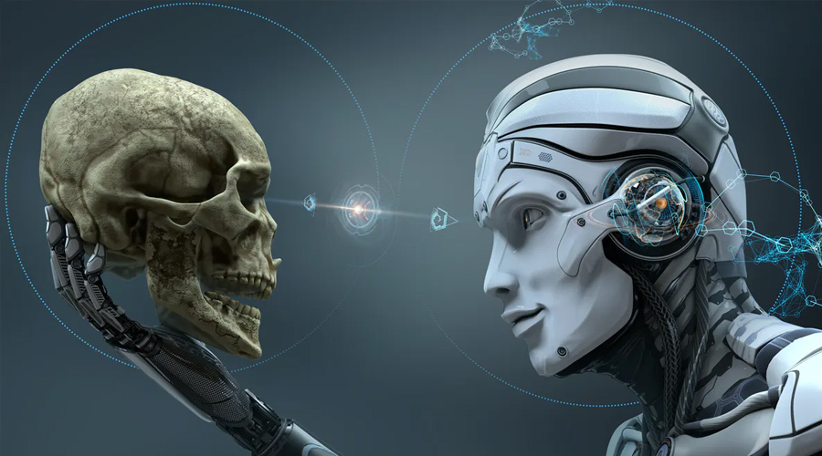
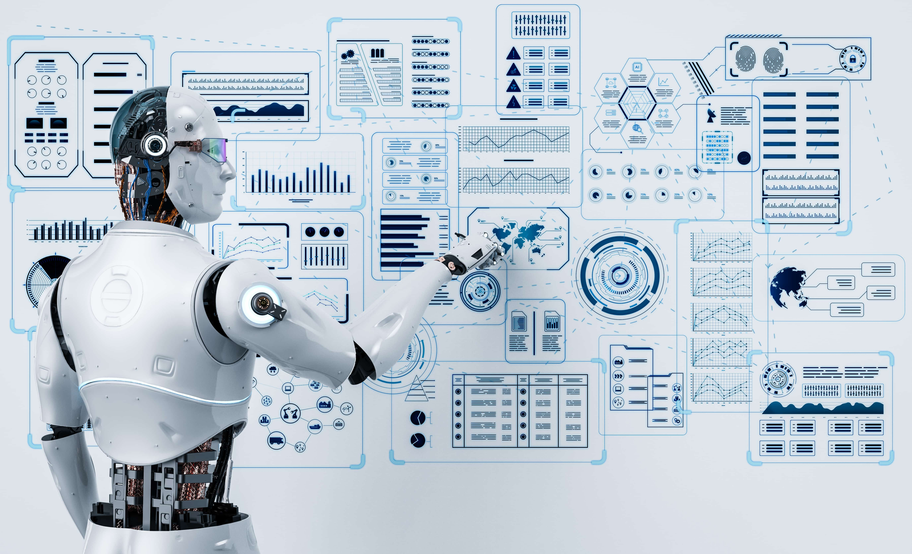

# ADEDIPE DAMILOLA EMMANUEL                                                  
###  PAGE 1                         
### TOPIC 
### [MY AUTOMATION_BLOG](Automation.md)

## ARTIFICIAL INTELLIGENCE (AI)

*WHAT IS ARTIFICIAL INTELLIGENCE (AI)*

  *Artificial intelligence* is the simulation of human intelligence processes by machines, especially computer systems. Specific applications of AI include expert systems, natural language processing  speech recognition and machine vision 

It can also be defined as the development of computer systems that can perform tasks that typically require human intelligence. These tasks include learning, reasoning, problem-solving, understanding natural language, speech recognition, and visual perception. AI aims to create machines or software that can simulate human cognitive functions and adapt to new information.
 
## TYPES OF ARTIFICIAL INTELLIGENCE (AI)

According to my research there 3 major types of AI 
They include: 
### 1. Narrow or weak AI, 
### 2. General or strong AI, 
### 3. Artificial superintelligence.

## NARROW OR WEAK AI :

This type of AI is designed to perform a specific task or a narrow set of tasks. It operates within a predefined range and lacks the ability to generalize to different domains. Examples include voice assistants like Siri or Alexa, image recognition software, and recommendation algorithms

## GENERAL OR STRONG AI :

This is a more advanced form of AI that can understand, learn, and apply knowledge across a broad range of tasks similar to human intelligence. Achieving strong AI is a complex and challenging goal, and as of now, we have only developed narrow AI systems.

## ARTIFICAL SUPERINTELLIGENCE :

This represents a level of AI that surpasses human intelligence across all domains. It is an advanced form of AI that, if realized, could potentially exhibit creativity, emotional intelligence, and problem-solving abilities at a level beyond human capabilities.

OTHER TYPES OF ARTIFICIAL INTELLIGENCE (AI)
THEY INCLUDE :

## Machine Learning (ML): 
  This is a subset of AI where algorithms enable systems to learn and improve from experience. It includes techniques such as supervised learning, unsupervised learning, and reinforcement learning.

## Deep Learning: 
   This is a subfield of machine learning that involves neural networks with multiple layers (deep neural networks). Deep learning has been particularly successful in tasks such as image and speech recognition.

## Natural Language Processing (NLP): 
   NLP focuses on enabling machines to understand, interpret, and generate human language. Applications include chatbots, language translation, and sentiment analysis.

## Type 1: Reactive machines. 
   These AI systems have no memory and are task-specific. An example is Deep Blue, the IBM chess program that beat Garry Kasparov in the 1990s. Deep Blue can identify pieces on a chessboard and make predictions, but because it has no memory, it cannot use past experiences to inform future ones.

## Type 2: Limited memory. :
   These AI systems have memory, so they can use past experiences to inform future decisions. Some of the decision-making functions in self driving cars are designed this way.

## Type 3: Theory of mind. :
   Theory of mind is a psychology term. When applied to AI, it means the system would have the social intelligence to understand emotions. This type of AI will be able to infer human intentions and predict behavior, a necessary skill for AI systems to become integral members of human teams.

## Type 4: Self-awareness. 
 In this category, AI systems have a sense of self, which gives them consciousness. Machines with self-awareness understand their own current state. This type of AI does not yet exist. 

 #  HISTORY OF ARTIFICIAL INTELLIGENCE (AI)
   

# WHO IS THE FATHER OF AI* 

  *John McCarthy* is considered as the father of Artificial Intelligence. John McCarthy was an American computer scientist. The term "artificial intelligence" was coined by him. He is one of the founder of artificial intelligence, together with Alan Turing, Marvin Minsky, Allen Newell, and Herbert 

  In the first half of the 20th century, science fiction familiarized the world with the concept of artificially intelligent robots. It began with the “heartless” Tin man from the Wizard of Oz and continued with the humanoid robot that impersonated Maria in Metropolis. By the 1950s, we had a generation of scientists, mathematicians, and philosophers with the concept of artificial intelligence (or AI) culturally assimilated in their minds. One such person was Alan Turing, a young British polymath who explored the mathematical possibility of artificial intelligence. Turing suggested that humans use available information as well as reason in order to solve problems and make decisions, so why can’t machines do the same thing? This was the logical framework of his 1950 paper, computing machinery and intelligence in which he discussed how to build intelligent machines and how to test their intelligence.

*The history of Artificial Intelligence (AI) spans several decades and has evolved through multiple phases of research, development, and technological advancements. Here's a brief overview of key milestones in the history of AI:*

   ### 1940s - 1950s: Early Concepts and Theoretical Foundations*
   
  * The concept of AI can be traced back to the 1940s and 1950s. Mathematician and logician Alan Turing proposed the Turing Test in 1950, suggesting that a machine could be considered intelligent if it could exhibit human-like behavior indistinguishable from that of a human
    * 1956: Birth of AI as a Field
    * The term "Artificial Intelligence" was coined during the Dartmouth Conference in 1956. The conference, organized by John McCarthy, Marvin Minsky, Nathaniel Rochester, and Claude Shannon, marked the official beginning of AI as a distinct field of study.

### 1950s - 1960s: Early AI Programs :

At the beginning of 1950, John Von Neumann and Alan Turing did not create the term AI but were the founding fathers of the technology behind it: they made the transition from computers to 19th century decimal logic (which thus dealt with values from 0 to 9) and machines to binary logic (which rely on Boolean algebra, dealing with more or less important chains of 0 or 1). The two researchers thus formalized the architecture of our contemporary computers and demonstrated that it was a universal machine, capable of executing what is programmed. Turing, on the other hand, raised the question of the possible intelligence of a machine for the first time in his famous 1950 article "Computing Machinery and Intelligence" and described a "game of imitation", where a human should be able to distinguish in a teletype dialogue whether he is talking to a man or a machine. However controversial this article may be (this "Turing test" does not appear to qualify for many experts), it will often be cited as being at the source of the questioning of the boundary between the human and the machine.Early AI research focused on symbolic reasoning and problem-solving. Programs like the Logic Theorist (1956) by Allen Newell and Herbert A. Simon and the General Problem Solver (1957) laid the groundwork for AI development.

### 1960s - 1970s: Rule-Based Systems and Expert Systems

   * AI researchers developed rule-based systems and expert systems, which encoded human knowledge in the form of rules. The Dendral project (1965) for chemical analysis and the Mycin system (1976) for medical diagnosis were notable examples.

### 1980s: Knowledge-Based Systems and Expert Systems Boom

   * The 1980s saw a surge in interest and investment in AI, particularly in expert systems. However, overhyped expectations and limitations in existing technology led to a period known as the "AI Winter," marked by reduced funding and enthusiasm.

### Late 1980s - 1990s: Machine Learning Renaissance

   * During the late 1980s and 1990s, there was a resurgence of interest in AI, fueled in part by advancements in machine learning. Neural networks, particularly backpropagation algorithms, gained attention. The field of machine learning began to thrive.

### 1997: Deep Blue vs. Garry Kasparov

   * IBM's Deep Blue, a chess-playing computer, defeated world chess champion Garry Kasparov in a landmark match in 1997. This event showcased the potential of AI in specialized tasks.

### 2000s: Rise of Data-Driven AI and Big Data

  * The 2000s witnessed a shift toward data-driven approaches in AI. The availability of large datasets and improvements in computing power contributed to advancements in machine learning and the emergence of Big Data analytics.Further advances in machine learning, deep learning, NLP, speech recognition and computer vision gave rise to products and services that have shaped the way we live today. These include the 2000 launch of Google's search engine and the 2001 launch of Amazon's recommendation engine. Netflix developed its recommendation system for movies, Facebook introduced its facial recognition system and Microsoft launched its speech recognition system for transcribing speech into text. IBM launched Watson and Google started its self-driving initiative, Waymo

 ### 2010s: Deep Learning Dominance and AI Applications

 * Deep learning, a subfield of machine learning involving neural networks with multiple layers, gained prominence in the 2010s. Breakthroughs in image and speech recognition, natural language processing, and autonomous systems fueled the application of AI in various industries.The decade between 2010 and 2020 saw a steady stream of AI developments. These include the launch of Apple's Siri and Amazon's Alexa voice assistants; IBM Watson's victories on Jeopardy; self-driving cars; the development of the first generative adversarial network; the launch of TensorFlow, Google's open source deep learning framework; the founding of research lab OpenAI, developers of the GPT-3 language model and Dall-E image generator; the defeat of world Go champion Lee Sedol by Google DeepMind's AlphaGo; and the implementation of AI-based systems that detect cancers with a high degree of accuracy.

 ### Present and Future: Continued Advancements and Ethical Consideration*
 
 * AI continues to advance rapidly, with applications in healthcare, finance, autonomous vehicles, and more. Ethical considerations, transparency, and responsible AI development have become key areas of focus.

## SOURCE : FROM GOGGLE , CHATGPT

# PAGE 2 ; DATE :05/12/2023

## HOW DOES AI WORKS AND HOW TO USE AI

  ####        Data Collection:
     AI systems require large amounts of data to learn and make predictions or decisions The quality and quantity of the data play a crucial role in the effectiveness of the AI model

   ####          	Data Preprocessing:
     Raw data often needs to be cleaned, organized, and transformed before it can be used to train an AI model. This step is crucial for improving the model's accuracy and efficiency.

 #### 	Training the Model:
     During the training phase, the AI model learns patterns and features from the preprocessed data. This involves using algorithms to adjust the model's parameters until it can make accurate predictions or classifications.

   ####            Testing and Validation:

     The trained model is tested on new data to ensure its performance is not limited to the training set. Validation helps identify and address issues such as overfitting (performing well on the training data but poorly on new data)

#### 		Deployment:
     Once the model has been trained and validated, it can be deployed for real-world use. This involves integrating the AI model into the desired application or system.

  ##            How to use AI:

#### 		Identify a Problem or Task:
     Determine a specific problem or task where AI can provide value. This could range from automating repetitive tasks to making predictions based on data.
   
####  Data Collection:
     Gather relevant data for the task at hand. The quality and quantity of data are critical factors in the success of an AI model.

  #### Choose an AI Approach:
     Select the appropriate AI approach based on the nature of the problem. This could involve using machine learning algorithms for pattern recognition or natural language processing for understanding and generating human language.

#### 		Select or Develop a Model:
     Choose an existing AI model or develop a custom model based on the chosen approach. Many pre-trained models are available for common tasks.

 #### Train the Model:
     Train the model using the collected and preprocessed data. This step involves adjusting the model's parameters to improve its performance on the specific task.

#### 		Testing and Validation:
     Evaluate the model's performance on new data to ensure it generalizes well and performs accurately in real-world scenarios.

#### 		Deployment:
     Integrate the trained model into the intended application or system for practical use.

#### 		Monitor and Update:
     Continuously monitor the AI system's performance, and update the model as needed. This may involve retraining the model with new data to adapt to changing conditions.

## WHAT ARE THE ADVANTAGES & DISADVANTAGES OF AI( ARTIFICIAL INTELLIGENCE )

### Advantages of Artificial Intelligence:

  ####      	Automation:
    * AI can automate repetitive and mundane tasks, freeing up human resources for more creative and complex activities.

#### 		Efficiency:
    * AI systems can process vast amounts of data at high speeds, leading to increased efficiency in decision-making and problem-solving.

#### 		Accuracy:
    * AI models, when properly trained, can provide highly accurate and consistent results, reducing the risk of human errors.

* #### 		24/7 Operations:
    * AI systems do not require breaks and can operate continuously, leading to around-the-clock availability and productivity.

* ####  		Data Analysis:
    * AI excels at analyzing large datasets, identifying patterns, and extracting valuable insights, which can inform better decision-making.

* #### 		Innovation and Creativity:
    * AI technologies, such as generative models, can contribute to creative processes by generating new ideas, designs, and content.

* #### 		Personalization:
    * AI enables personalized experiences in areas like content recommendations, marketing, and user interfaces, tailoring services to individual preferences.

* #### 		Medical Advances:
    * AI is used in healthcare for diagnostic purposes, drug discovery, and personalized medicine, contributing to advancements in patient care.

## Disadvantages of Artificial Intelligence:

* #### 		Job Displacement:
    * Automation driven by AI can lead to job displacement in certain industries, as machines may replace certain human tasks.

* #### 		Bias and Fairness:
    * AI models can inherit biases present in training data, leading to biased outcomes and decisions. Ensuring fairness and mitigating biases is a significant challenge.

* #### 		Lack of Creativity:
    * While AI can perform specific creative tasks, it lacks true creativity, intuition, and emotional understanding that humans possess.

* #### 		Security Concerns:
    * As AI becomes more integrated into various systems, there are concerns about the security of AI applications, including vulnerabilities to hacking and malicious use.

* #### 		Ethical Concerns:
    * AI raises ethical questions related to privacy, accountability, and the responsible use of technology. Ensuring that AI systems are used ethically is a complex challenge.

* #### 		Dependency and Reliability:
    * Overreliance on AI systems can pose risks, especially when they malfunction or encounter unforeseen situations. Ensuring the reliability of AI systems is crucial.

* #### 		High Initial Costs:
    * Developing and implementing AI technologies can require significant financial investments in terms of infrastructure, training, and research.

* #### 		Lack of Understanding:
    * The complexity of AI algorithms and models can make them difficult to understand, leading to challenges in interpreting and explaining their decisions (the "black box" problem).

# What are the applications of AI?

####   AI In Health Care 
 
The biggest bets are on improving patient outcomes and reducing costs. Companies are applying machine learning to make better and faster medical diagnoses than humans. One of the best-known healthcare technologies is IBM Watson. It understands natural language and can respond to questions asked of it. The system mines patient data and other available data sources to form a hypothesis, which it then presents with a confidence scoring schema. Other AI applications include using online virtual health assistants and chatbots  to help patients and healthcare customers find medical information, schedule appointments, understand the billing process and complete other administrative processes. 

####   AI In Bussiness.
 
 Machine learning algorithms are being integrated into analytics and customer relationship management  platforms to uncover information on how to better serve customers. Chatbots have been incorporated into websites to provide immediate service to customers. The rapid advancement of generative AI technology such as chatGPT is expected to have far-reaching consequences: eliminating jobs, revolutionizing product design and disrupting business models.

####   AI In Education. 
 
AI can automate grading, giving educators more time for other tasks. It can assess students and adapt to their needs, helping them work at their own pace. AI tutors can provide additional support to students, ensuring they stay on track. The technology could also change where and how students learn, perhaps even replacing some teachers. As demonstrated by ChatGPT and other large language models, generative AI can help educators craft course work and other teaching materials and engage students in new ways. The advent of these tools also forces educators to rethink student homework and testing and revise policies on plagiarism.

  ####  AI in finance.
  
 AI in personal finance applications, such as Intuit Mint or TurboTax, is disrupting financial institutions. Applications such as these collect personal data and provide financial advice. Other programs, such as IBM Watson, have been applied to the process of buying a home. Today, artificial intelligence software performs much of the trading on Wall Street.

 
####  AI in entertainment and media. 
The entertainment business uses AI techniques for targeted advertising, recommending content, distribution, detecting fraud, creating scripts and making movies. Automated journalism helps newsrooms streamline media workflows reducing time, costs and complexity. Newsrooms use AI to automate routine tasks, such as data entry and proofreading; and to research topics and assist with headlines. How journalism can reliably use ChatGPT and other generative AI to generate content is to open a question 

#### AI in software coding and IT processes. 
New generative AI tools can be used to produce application code based on natural language prompts, but it is early days for these tools and unlikely they will replace software engineers soon. AI is also being used to automate many IT processes, including data entry, fraud detection, customer service, and predictive maintenance and security.

####   Security. 
AI and machine learning are at the top of the buzzword list security vendors use to market their products, so buyers should approach with caution. Still, AI techniques are being successfully applied to multiple aspect  including anomaly detection, solving the false -positive problem  and conducting behavioral threat analytics. Organizations use machine learning in security information and event management software and related areas to detect anomalies and identify suspicious activities that indicate threats. By analyzing data and using logic to identify similarities to known malicious code, AI can provide alerts to new and emerging attacks much sooner than human employees and previous technology iterations.

####   AI In Banking. 
 
Banks are successfully employing chatbots to make their customers aware of services and offerings and to handle transactions that don't require human intervention. AI virtual assistants are used to improve and cut the costs of compliance with banking regulations. Banking organizations use AI to improve their decision-making for loans, set credit limits and identify investment opportunities.

####   AI In Transportation. 
  
In addition to AI's fundamental role in operating autonomous vehicles, AI technologies are used in transportation to manage traffic, predict flight delays, and make ocean shipping safer and more efficient. In supply chains, AI is replacing traditional methods of forecasting demand and predicting disruptions, a trend accelerated by COVID-19 when many companies were caught off guard by the effects of a global pandemic on the supply and demand of goods.

## SOURCE : FROM GOGGLE , CHATGPT

### PAGE 3 ( 30/12/2023)

# CAN AI BE DANGEROUS 
 

Artificial Intelligence (AI) holds immense potential for transforming various aspects of our lives, from automating routine tasks to advancing medical diagnostics. However, the rapid progress in AI technology has also raised concerns about its potential dangers. The question of whether AI can be dangerous is complex and multifaceted, touching upon ethical, societal, and technical dimensions.
One significant concern revolves around the idea of autonomous AI systems making decisions without human intervention. If these systems operate based on flawed algorithms or biased data, they can perpetuate and even amplify existing societal inequalities. For instance, biased facial recognition algorithms have been shown to disproportionately misidentify individuals from certain ethnic groups, leading to discriminatory consequences. This raises ethical questions about the responsible development and deployment of AI technologies.
Another aspect contributing to AI's potential danger lies in its ability to surpass human intelligence. The concept of artificial general intelligence (AGI), where machines could perform any intellectual task that a human being can, poses existential risks. If AGI surpasses human intelligence without proper safeguards, it could lead to unintended consequences or even pose threats to humanity. Sci-fi scenarios of AI turning against its creators highlight the importance of establishing robust ethical frameworks and control mechanisms.
Furthermore, the use of AI in autonomous weapons systems has sparked debates about the potential for AI to be weaponized. The deployment of AI-driven military technologies raises concerns about the loss of human control over lethal decisions, as well as the risk of unintended escalations. Striking the right balance between leveraging AI for defense purposes and preventing the creation of autonomous weapons that act independently of human oversight is crucial for global security.
Privacy is another significant concern associated with AI. As AI systems process vast amounts of data to make predictions and decisions, the potential for unauthorized access or misuse of personal information becomes a pressing issue. Ensuring robust data protection measures and transparency in AI algorithms is essential to mitigate the risks of privacy infringements.
In conclusion, while AI offers numerous benefits, it also poses potential dangers that need careful consideration. Ethical guidelines, regulatory frameworks, and ongoing research are crucial to address the risks associated with AI development and deployment. Striking a balance between innovation and responsible use is imperative to harness the full potential of AI while safeguarding against unintended consequences that could arise from its unchecked proliferation.

# DIFFERENCE BETWEEN AI AND OTHER COMPUTER LANGUAGES 

Artificial Intelligence (AI) and traditional computer programming languages serve distinct purposes in the realm of computing, each with its unique characteristics and applications. Understanding the differences between AI and other computer languages is crucial for grasping their roles in shaping the technological landscape.

At its core, a computer programming language is a set of instructions that a computer can interpret and execute. Traditional programming languages, such as C++, Java, and Python, follow a deterministic paradigm. Programmers use these languages to explicitly define step-by-step instructions for a computer to perform specific tasks. This approach is effective for solving problems with well-defined rules and logical structures.

In contrast, AI is not a programming language per se; rather, it is a field of study that encompasses various techniques and approaches to create machines capable of intelligent behavior. AI leverages a range of methodologies, including machine learning, natural language processing, and neural networks, to enable systems to learn from data, adapt to changing inputs, and make decisions without explicit programming.

One key distinction lies in the nature of programming. Traditional languages require developers to provide explicit instructions for every possible scenario. In AI, however, the emphasis shifts to creating algorithms that can learn and generalize from data, allowing systems to handle tasks they weren't explicitly programmed for. This adaptability is a hallmark of AI, enabling it to excel in tasks like image recognition, language translation, and playing complex games.

Another difference is the role of data in these domains. Traditional programming relies on structured data and predefined algorithms. In AI, large datasets become a crucial component for training models. Machine learning algorithms, a subset of AI, use patterns and relationships within data to improve performance over time. This data-driven approach distinguishes AI from traditional programming and underlines the importance of quality datasets in developing effective AI systems.

Additionally, the programming mindset differs between traditional languages and AI. In conventional programming, developers often have a clear understanding of the problem and the steps needed to solve it. With AI, the focus shifts towards defining the problem and providing sufficient data for the system to learn patterns. This shift requires a more exploratory and iterative approach, where refining models is an ongoing process.

Scalability is another area where AI and traditional programming diverge. Traditional programs are designed with specific inputs and outputs in mind, and scaling often involves adapting the codebase for different scenarios. In AI, scalability is often achieved by providing more diverse and relevant data, allowing the system to generalize across various situations. This scalability is particularly advantageous in applications like recommendation systems and predictive analytics.

The level of abstraction is also a distinguishing factor. Traditional programming languages operate at a lower level of abstraction, requiring precise and detailed instructions. AI, especially when utilizing high-level frameworks like TensorFlow or PyTorch, abstracts away many implementation details, allowing developers to focus more on the overall architecture and less on the minutiae of individual computations.

In conclusion, while both AI and traditional programming languages fall under the umbrella of computer science, they represent distinct approaches to problem-solving. Traditional programming languages are rule-based and deterministic, relying on explicit instructions from developers. In contrast, AI leverages data-driven techniques, allowing systems to learn and adapt, making it particularly powerful for tasks involving uncertainty, pattern recognition, and complex decision-making. Recognizing these differences is essential for navigating the diverse landscape of modern computing and choosing the right tools for specific applications.

### SOURCE CHAT GPT

### PAGE 4 
DATE - 9/01/2024

# Exploring Machine Learning Algorithms and Applications

Machine Learning (ML) has emerged as a transformative technology that enables computers to learn from data and improve their performance over time without explicit programming. Within the vast realm of machine learning, various algorithms are employed to achieve different objectives. In this exploration, we delve into three fundamental categories of machine learning algorithms: Supervised Learning, Unsupervised Learning, and Reinforcement Learning. Additionally, we'll explore the fascinating applications of Natural Language Processing (NLP), focusing on Text Analysis, Sentiment Analysis, and Language Translation.

### Supervised Learning:

Supervised Learning is a type of machine learning where the algorithm is trained on a labeled dataset, meaning that the input data is paired with corresponding output labels. The goal is for the algorithm to learn the mapping between inputs and outputs, allowing it to make predictions on new, unseen data. Common algorithms in supervised learning include Linear Regression, Decision Trees, Support Vector Machines (SVM), and Neural Networks. Applications range from predicting stock prices to classifying spam emails and identifying objects in images.

### Unsupervised Learning:

In contrast to supervised learning, Unsupervised Learning involves algorithms learning from unlabeled data, seeking to uncover patterns and relationships within the dataset. Clustering and association are common tasks in unsupervised learning. Prominent algorithms include K-Means Clustering, Hierarchical Clustering, and Principal Component Analysis (PCA). Unsupervised learning finds applications in customer segmentation, anomaly detection, and data compression, among others.

### Reinforcement Learning:

Reinforcement Learning is a paradigm where an agent learns to make decisions by interacting with an environment. The agent receives feedback in the form of rewards or punishments based on the actions it takes. The goal is to learn a policy that maximizes the cumulative reward over time. Reinforcement Learning is widely used in applications such as game playing (as seen in AlphaGo and OpenAI's Dota 2 bots), robotic control, and autonomous systems.

### Natural Language Processing (NLP):

Natural Language Processing is a field at the intersection of computer science, artificial intelligence, and linguistics. It focuses on the interaction between computers and human language. NLP enables machines to understand, interpret, and generate human-like text. Within NLP, three specific applications stand out:

### Text Analysis:

Text Analysis, also known as Text Mining or Text Analytics, involves extracting meaningful insights and patterns from unstructured text data. Techniques include tokenization, stemming, and sentiment analysis. Businesses use text analysis to gain valuable insights from customer feedback, social media, and document repositories.

### Sentiment Analysis:

Sentiment Analysis, a subset of Text Analysis, aims to determine the sentiment expressed in a piece of text, whether it's positive, negative, or neutral. This application is prevalent in social media monitoring, customer reviews, and brand reputation management. Sentiment analysis algorithms use natural language processing techniques to understand the emotional tone conveyed in written text.

### Language Translation:

Language Translation involves automatically translating text or speech from one language to another. Machine translation systems, such as Google Translate, employ advanced NLP algorithms to understand the context and nuances of different languages. This application facilitates global communication, breaking down language barriers in various domains, including business, travel, and academia.

### Conclusion:

Machine learning algorithms have become integral to solving complex problems and driving innovation across diverse domains. Supervised learning excels in making predictions based on labeled data, while unsupervised learning uncovers hidden patterns in unlabeled datasets. Reinforcement learning allows machines to learn optimal decision-making strategies through interaction with an environment. In the realm of Natural Language Processing, text analysis, sentiment analysis, and language translation showcase the power of machines in understanding and processing human language.

#### SOURCE GOOGLE & CHATGPT

# [MY AUTOMATION_BLOG](Automation.md)
