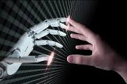

# (Artificial intelligence) AI

  ADEDIPE EMMANUELS BLOG 
    

 Artificial Intelligence: Transforming the Future of Humanity
Artificial Intelligence (AI) is no longer a futuristic concept; it has become an integral part of our daily lives. From virtual assistants on our smartphones to self-driving cars and personalized movie recommendations, AI is revolutionizing the way we live, work, and interact with the world. This article explores the profound impact of AI on various aspects of our lives and its promising future.

Understanding AI

AI refers to the development of computer systems that can perform tasks that typically require human intelligence. These tasks include problem-solving, learning, reasoning, understanding natural language, and making decisions. AI systems can range from basic rule-based programs to advanced machine learning algorithms.

AI in Everyday Life

AI has become deeply embedded in our daily routines. Smart home devices like Amazon's Alexa and Google Home are AI-driven virtual assistants that can answer questions, control household appliances, and even engage in conversation. Recommendation systems used by streaming platforms, such as Netflix and Spotify, analyze our preferences to suggest content we might enjoy.

In healthcare, AI is enhancing the speed and accuracy of diagnoses. Radiologists use AI to assist in the interpretation of medical images, while chatbots provide immediate medical advice. AI-driven chatbots are also revolutionizing customer service in various industries, offering quick and efficient responses to user queries.

AI in Industry and Business

AI has had a profound impact on the business world. In manufacturing, AI-driven robots automate tasks, leading to increased efficiency and reduced errors. In finance, AI is used for algorithmic trading and fraud detection. Supply chain management benefits from predictive analytics, optimizing routes, and minimizing delays.

Marketing and e-commerce are no strangers to AI, as it can analyze vast amounts of data to target potential customers with tailored advertisements. AI chatbots and virtual shopping assistants enhance customer experience. In fact, AI-driven personalization has become a significant driving force behind online shopping.
AI and Healthcare

In healthcare, AI is making remarkable strides. Machine learning algorithms can analyze medical records to predict disease outbreaks, while wearable devices monitor patients in real-time. Drug discovery benefits from AI's ability to analyze complex chemical interactions, potentially speeding up the development of new treatments.

AI Challenges and Ethical Considerations

While AI offers immense potential, it also poses challenges and ethical considerations. Privacy concerns arise with the collection and analysis of personal data. The risk of AI bias, where algorithms may reinforce existing prejudices, is another issue. Ethical guidelines and regulations are essential to ensure AI is developed and used responsibly.

The Future of AI

The future of AI is bright and dynamic. The development of quantum computing may further accelerate AI capabilities, enabling the processing of even more complex tasks. AI's application in fields like autonomous vehicles, space exploration, and climate change analysis promises to bring about groundbreaking advancements.

Conclusion

AI has rapidly transformed the way we live and work, offering unprecedented opportunities and challenges. It has already proven its potential in various industries, from healthcare to finance, and it continues to evolve. As AI's capabilities expand, its role in shaping the future of humanity becomes increasingly significant. The key lies in responsible development and ethical deployment to ensure AI benefits all of society.

SOURCE : CHAT GPT 
